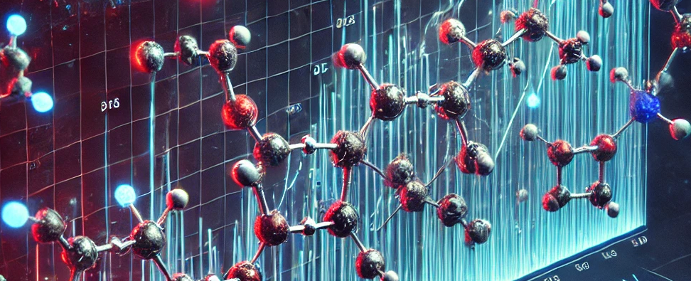

<h1 align="center"> Mol2DreaMS </h1>

<!-- [](https://doi.org/10.5281/zenodo.13208732) -->
<!-- [](https://github.com/anton-bushuiev/PPIRef/actions/workflows/python-package.yml) -->

<p>
  <a href="https://chemrxiv.org/engage/chemrxiv/article-details/6626775021291e5d1d61967f"></a>
  <a href='https://dreams-docs.readthedocs.io/en/latest/?badge=latest'></a>
  <a href="https://opensource.org/licenses/MIT"></a>
  <a href="https://www.python.org/downloads/release/python-3110/"></a>
  <a href="https://pytorch.org/get-started/pytorch-2.0/"></a>
  <a href="https://huggingface.co/datasets/roman-bushuiev/GeMS/tree/main/data"> </a>
  <a href="https://zenodo.org/records/10997887"></a>
  <a href="https://zenodo.org/records/13843034"></a>
<p>

<p align="center">
  
</p>
mol2DreaMS

mol2DreaMS is a deep learning framework designed to align molecular embeddings with the DreaMS spectral embeddings. By bridging the gap between molecular structures and mass spectrometry data

Built as a subpackage of the DreaMS project, mol2DreaMS provides tools and models to:

	•	Align molecular embeddings with DreaMS spectral embeddings.
	•	Facilitate searching in the DreaMS Atlas to retrieve relevant spectral embeddings.

For detailed explanations on how to work with mol2DreaMS, please refer to the provided notebooks and code within the mol2dreams subpackage. Tutorials on how to run and work with the code are available in the mol2dreams/notebooks directory, specifically in the notebooks with the _tutorial suffix, where everything is explained.

If you are interested in contributing to this project or have ideas for new features, we would be pleased to hear from you. Please do not hesitate to contact us!

## Getting started

### Installation
Run the following code from the command line.

``` shell
# Download this repository
git clone https://github.com/Jozefov/mol2DreaMS.git
cd mol2DreaMS

# Create conda environment
conda create -n mol2DreaMS python==3.11.0 --yes
conda activate mol2DreaMS

# Install DreaMS
pip install -e .
```

If you are not familiar with conda or do not have it installed, please refer to the [official documentation](https://conda.io/projects/conda/en/latest/user-guide/getting-started.html).

## References

- Paper: [https://chemrxiv.org/engage/chemrxiv/article-details/6626775021291e5d1d61967f](https://chemrxiv.org/engage/chemrxiv/article-details/6626775021291e5d1d61967f).
- Documentation and tutorials: [https://dreams-docs.readthedocs.io/](https://dreams-docs.readthedocs.io/).
- Weights of pre-trained models: [https://zenodo.org/records/10997887](https://zenodo.org/records/10997887).
- Datasets:
  - GeMS dataset: [https://huggingface.co/datasets/roman-bushuiev/GeMS/tree/main/data](https://huggingface.co/datasets/roman-bushuiev/GeMS/tree/main/data).
  - DreaMS Atlas: [https://huggingface.co/datasets/roman-bushuiev/GeMS/tree/main/data/DreaMS_Atlas](https://huggingface.co/datasets/roman-bushuiev/GeMS/tree/main/data/DreaMS_Atlas).
  - Labeled MS/MS spectra: [https://huggingface.co/datasets/roman-bushuiev/GeMS/tree/main/data/auxiliary](https://huggingface.co/datasets/roman-bushuiev/GeMS/tree/main/data/auxiliary).

If you use DreaMS in your research, please cite the following paper:

```bibtex
@article{bushuiev2024emergence,
    author = {Bushuiev, Roman and Bushuiev, Anton and Samusevich, Raman and Brungs, Corinna and Sivic, Josef and Pluskal, Tomáš},
    title = {Emergence of molecular structures from repository-scale self-supervised learning on tandem mass spectra},
    journal = {ChemRxiv},
    doi = {doi:10.26434/chemrxiv-2023-kss3r-v2},
    year = {2024}
}
```